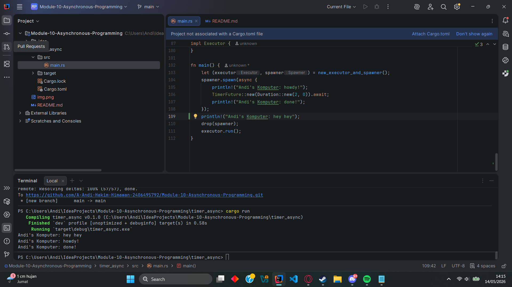
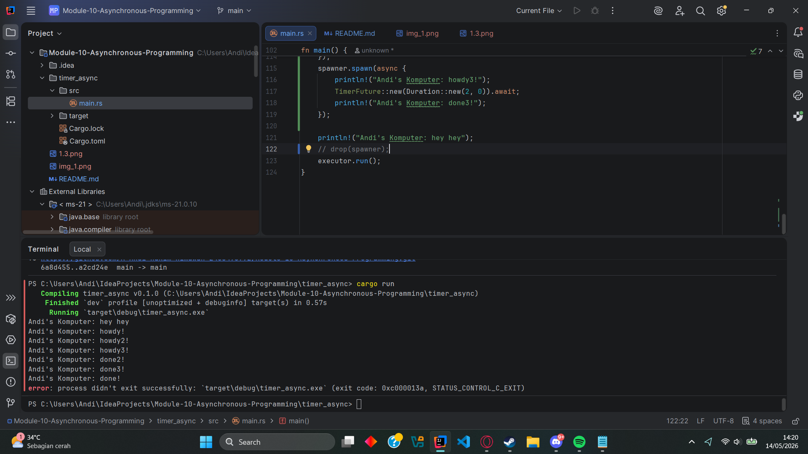
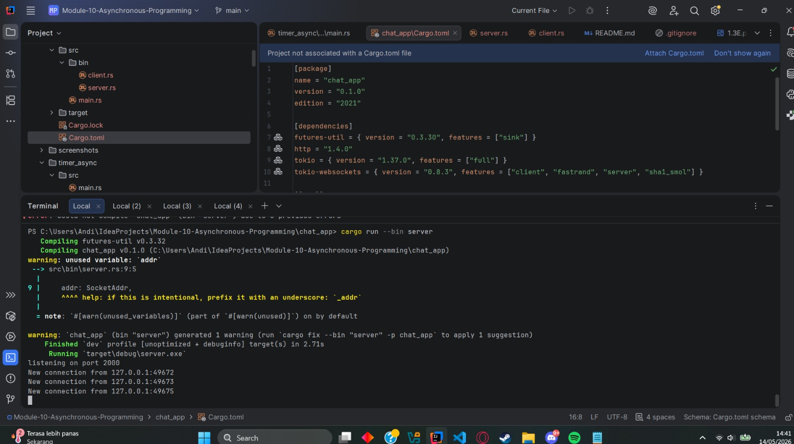
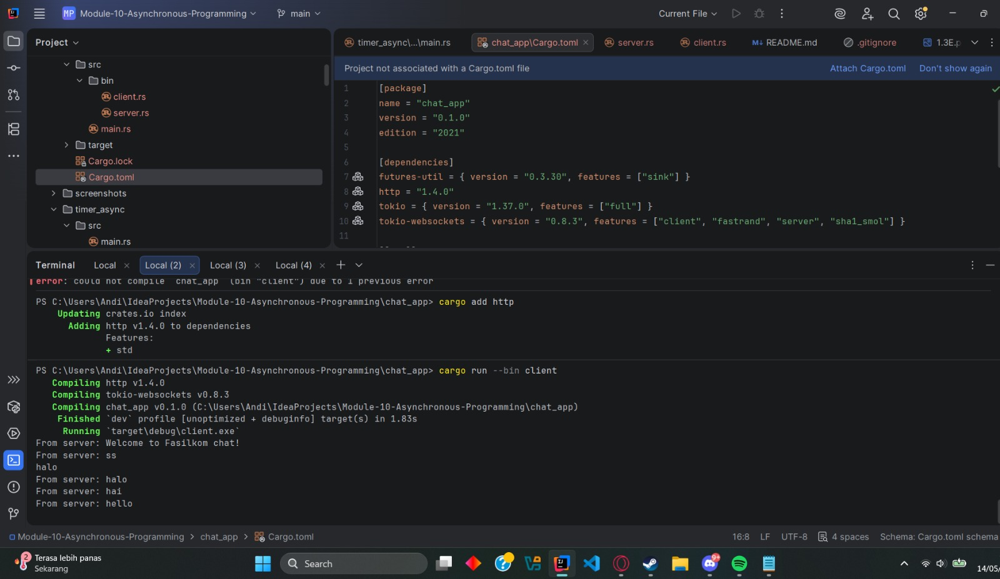
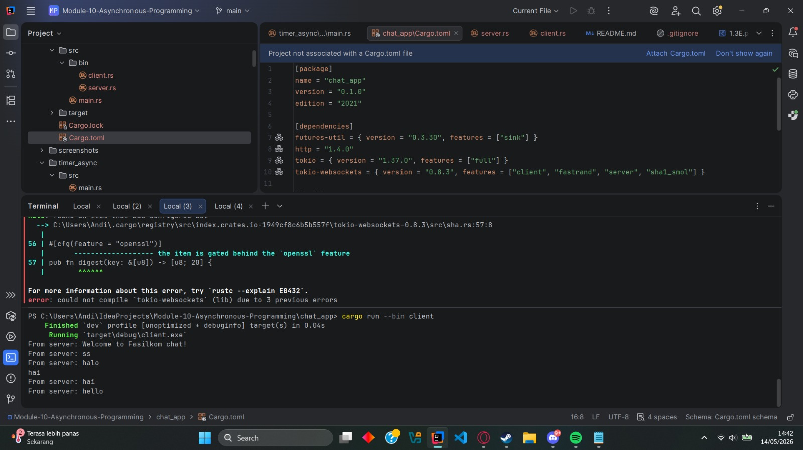
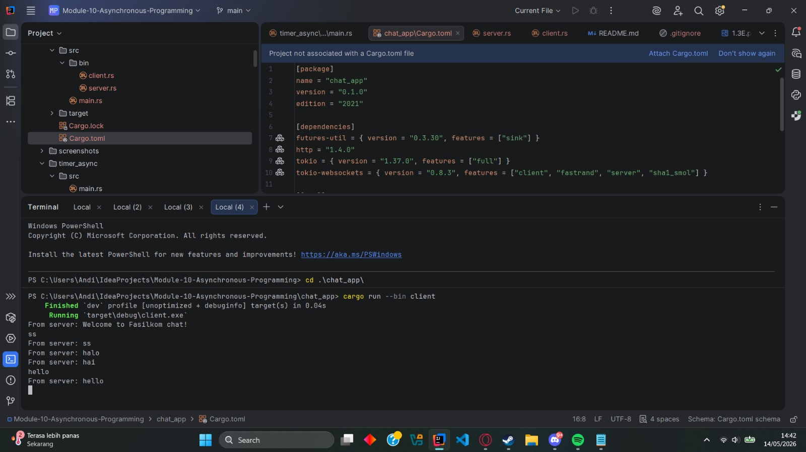
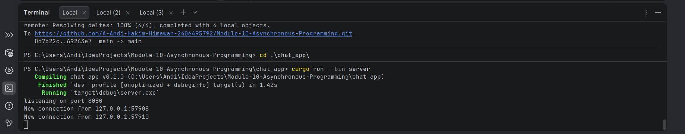
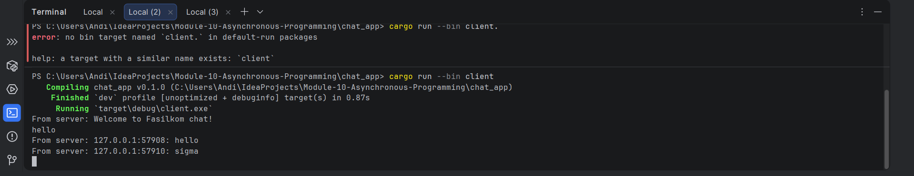
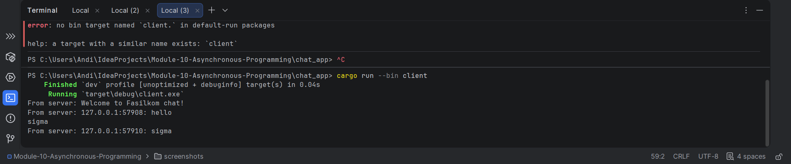

## Experiment 1.2

Teks "hey hey" tercetak sebelum "done!". Hal ini terjadi karena proses spawner.spawn mengutus future secara asinkron tanpa memblokir proses thread utama. Eksekusi "hey hey" berjalan seketika, sementara "done!" harus menunggu TimerFuture menahan state selama 2 detik sebelum akhirnya executor melanjutkan eksekusinya.

## Experiment 1.3

Ketika beberapa task di-spawn, semuanya berjalan secara konkuren. "howdy", "howdy2", "howdy3" muncul nyaris bersamaan, diikuti jeda 2 detik, lalu "done", "done2", "done3" juga dieksekusi bersamaan. Penghapusan drop(spawner) menyebabkan program mengalami infinite loop (menggantung). drop(spawner) berfungsi memberi sinyal penutupan pada channel sender. Tanpanya, executor.run() akan terus berada dalam status listening karena mengira spawner masih aktif dan akan mengirimkan task baru.

## Experiment 2.1

Aplikasi terdiri dari server dan client. Ketika klien mengetik pesan, pesan dikirim via WebSockets ke server, lalu server mem-broadcast pesan tersebut ke channel di mana semua klien yang terhubung telah men-subscribe, sehingga pesan muncul di semua terminal klien.

## Experiment 2.2

Pengubahan port dari 2000 menjadi 8080 berhasil dilakukan. Perubahan ini wajib diterapkan secara sinkron di kedua belah pihak (Server dan Client) karena mekanisme komunikasi WebSocket yang berjalan di atas protokol TCP.

Secara teknis, server bertugas membuka jalur jaringan dan mendengarkan permintaan masuk secara aktif melalui TcpListener::bind("127.0.0.1:8080"). Di sisi lain, client adalah pihak yang memulai koneksi. Saat client memanggil alamat Uri::from_static("ws://127.0.0.1:8080"), ia mengirimkan HTTP Request awal untuk melakukan WebSocket Handshake, yaitu proses persetujuan antara client dan server untuk mengubah (upgrade) jalur HTTP biasa menjadi saluran komunikasi WebSocket dua arah.

Jika port pada client dibiarkan menunjuk ke 2000 sementara server sudah pindah ke 8080, client akan mengetuk "pintu" jaringan yang salah atau tertutup, sehingga koneksi TCP ditolak (Connection Refused). Oleh karena itu, kecocokan port antara URI request klien dan TCP Listener server adalah syarat mutlak agar koneksi dapat terjalin.

## Experiment 2.3

Penambahan informasi pengirim dilakukan di sisi server. Server memotong incoming message, menyisipkan format addr (IP dan Port soket client), sebelum memasukkannya ke broadcast channel. Hal ini krusial untuk melacak sumber pesan.